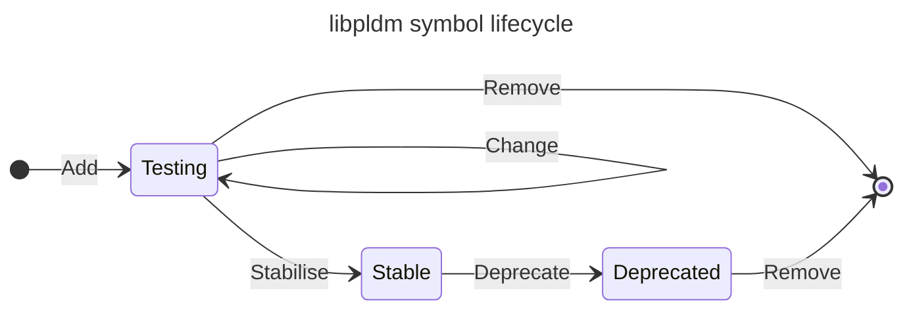

# Checklist for making changes to `libpldm`

## Philosophy and influences

- [Good Practices in Library Design, Implementation, and Maintenance - Ulrich
  Drepper][goodpractice]

[goodpractice]: https://www.akkadia.org/drepper/goodpractice.pdf

- [How Do I Make This Hard to Misuse? - Rusty Russell][rusty-api-scale-good]

[rusty-api-scale-good]: https://ozlabs.org/~rusty/index.cgi/tech/2008-03-30.html

- [What If I Don't Actually Like My Users? - Rusty Russell][rusty-api-scale-bad]

[rusty-api-scale-bad]: https://ozlabs.org/~rusty/index.cgi/tech/2008-04-01.html

- [Red flags that indicate questionable quality - Lennart
  Poettering][poettering-library-red-flags]

[poettering-library-red-flags]:
  https://mastodon.social/@pid_eins/112517953375791453

- [Not sure if this is a gcc bug or some weird corner of UB or what... - Andrew
  Zonenberg][azonenberg-packed-struct]

[azonenberg-packed-struct]: https://ioc.exchange/@azonenberg/112535511250395148

- [The Good, the Bad, and the Weird - Trail of Bits
  Blog][trail-of-bits-weird-machines]

[trail-of-bits-weird-machines]:
  https://blog.trailofbits.com/2018/10/26/the-good-the-bad-and-the-weird/

- [Logic for Programmers - Hillel Wayne][logic-for-programmers]

[logic-for-programmers]: https://leanpub.com/logic

- [Parse, don’t validate - Alexis King][alexis-king-parse-dont-validate]

[alexis-king-parse-dont-validate]:
  https://lexi-lambda.github.io/blog/2019/11/05/parse-don-t-validate/

- [The byte order fallacy - command center][command-center-byte-order-fallacy]

[command-center-byte-order-fallacy]:
  https://commandcenter.blogspot.com/2012/04/byte-order-fallacy.html

- [what’s the most annoying thing about writing C - Jessica
  Paquette][barrelshifter-annoying-c]

[barrelshifter-annoying-c]:
  https://mastodon.social/@barrelshifter/114016810912730423

- [The Power of Ten: Rules for Developing Safety Critical Code - NASA/JPL
  Laboratory for Reliable Software][nasa-reliable-code]

[nasa-reliable-code]:
  https://www.cs.otago.ac.nz/cosc345/resources/nasa-10-rules.pdf

- [C Isn't A Programming Language Anymore - Aria Desires][aria-c-is-a-protocol]

[aria-c-is-a-protocol]: https://faultlore.com/blah/c-isnt-a-language/

- [To be a better programmer, write little proofs in your head - Matthew
  Prast][matthew-prast-little-proofs]

[matthew-prast-little-proofs]:
  https://the-nerve-blog.ghost.io/to-be-a-better-programmer-write-little-proofs-in-your-head/

## References

- [The C programming language - C Standards Committee][c-language]

[c-language]: https://www.c-language.org/

- [SEI CERT C Coding Standard][sei-cert-c-coding-standard]

[sei-cert-c-coding-standard]:
  https://wiki.sei.cmu.edu/confluence/display/c/SEI+CERT+C+Coding+Standard

- [Common Weakness Enumeration (CWE) - Software
  Development][common-weakness-enumeration-sw]

[common-weakness-enumeration-sw]:
  https://cwe.mitre.org/data/definitions/699.html

## Definitions

- **Error condition**: An invalid state reached at runtime, caused either by
  resource exhaustion, or incorrect use of the library's public APIs and data
  types.

- **Invariant**: A condition in the library's implementation that must never
  evaluate false.

- **Public API**: Any definitions and declarations under `include/libpldm`.

- **Wire format**: Any message structure defined in the DMTF PLDM protocol
  specifications.

## Elaborations

- Resource exhaustion is always an error condition and never an invariant
  violation.

- An invariant violation is always a programming failure of the library's
  implementation, and never the result of incorrect use of the library's public
  APIs (see error condition).

- Corollaries of the above two points:
  - Incorrect use of public API functions is always an error condition, and is
    dealt with by returning an error code.

  - Incorrect use of static functions in the library's implementation is an
    invariant violation which may be established using `assert()`.

- `assert()` is the recommended way to demonstrate invariants are upheld.

## Library background

### The ABI lifecycle



The ABI of the library produced by the build is controlled using the `abi` meson
option. The following use cases determine how the `abi` option should be
specified:

| Use Case    | Meson Configuration               |
| ----------- | --------------------------------- |
| Production  | `-Dabi=deprecated,stable`         |
| Maintenance | `-Dabi=stable`                    |
| Development | `-Dabi=deprecated,stable,testing` |

### Maintenance

Applications and libraries that depend on `libpldm` can identify how to migrate
off of deprecated APIs by constraining the library ABI to the stable category.
This will force the compiler identify any call-sites that try to link against
deprecated symbols.

### Development

Applications and libraries often require functionality that doesn't yet exist in
`libpldm`. The work is thus in two parts:

1. Add the required APIs to `libpldm`
2. Use the new APIs from `libpldm` in the dependent application or library

Adding APIs to a library is a difficult task. Generally, once an API is exposed
in the library's ABI, any changes to the API risk breaking applications already
making use of it. To make sure we have more than one shot at getting an API
right, all new APIs must first be exposed in the testing category. Concretely:

Patches adding new APIs MUST mark them as testing and MUST NOT mark them as
stable.

### Marking functions as testing, stable or deprecated

Three macros are provided through `config.h` (automatically included for all
translation units) to mark functions as testing, stable or deprecated:

1. `LIBPLDM_ABI_TESTING`
2. `LIBPLDM_ABI_STABLE`
3. `LIBPLDM_ABI_DEPRECATED`

These annotations go immediately before your function signature:

```c
LIBPLDM_ABI_TESTING
pldm_requester_rc_t pldm_transport_send_msg(struct pldm_transport *transport,
                                            pldm_tid_t tid,
                                            const void *pldm_req_msg,
                                            size_t req_msg_len)
{
    ...
}
```

### What does it mean to mark a function as stable?

Marking a function as stable makes the following promise to users of the
library:

> We will not remove or change the symbol name, argument count, argument types,
> return type, or interpretation of relevant values for the function before
> first marking it as `LIBPLDM_ABI_DEPRECATED` and then subsequently creating a
> tagged release

Marking a function as stable does _not_ promise that it is free of
implementation bugs. It is just a promise that the prototype won't change
without notice.

Given this, it is always okay to implement functions marked stable in terms of
functions marked testing inside of libpldm. If we remove or change the prototype
of a function marked testing the only impact is that we need to fix up any call
sites of that function in the same patch.

### Requirements for stabilising a function

To move a function from the testing category to the stable category, it's
required that patches demonstrating use of the function in a dependent
application or library be linked in the commit message of the stabilisation
change. We require this to demonstrate that the implementer has considered its
use in context _before_ preventing us from making changes to the API.

### Building a dependent application or library against a testing ABI

Meson is broadly used in the OpenBMC ecosystem, the historical home of
`libpldm`. Meson's subprojects are a relatively painless way of managing
dependencies for the purpose of developing complex applications and libraries.
Use of `libpldm` as a subproject is both supported and encouraged.

`libpldm`'s ABI can be controlled from a parent project through meson's
subproject configuration syntax:

```shell
meson setup ... -Dlibpldm:abi=deprecated,stable,testing ...
```

## General practices

- [ ] My commit message subject is prefixed with the name of the impacted
      subsystem

- [ ] My commit message describes testing practices only if the discussion is
      substantive.
  - The description must contain enough information for someone else to
    reproduce the setup and verify the results.

  - A section on testing should not be added if there was no specific testing
    performed

## Adding a new API

### Naming macros, functions and types

- [ ] All publicly exposed macros, types and functions relating to the PLDM
      specifications must be prefixed with either `pldm_` or `PLDM_` as
      appropriate
  - The only (temporary) exception are the `encode_*()` and `decode_*()`
    function symbols

- [ ] `encode_*()` and `decode_*()` functions are named after their
      corresponding message struct type, where applicable
  - For example, given `struct pldm_platform_cper_event`, the associated
    functions should be named:
    - `encode_pldm_platform_cper_event()`
    - `decode_pldm_platform_cper_event()`

- [ ] All publicly exposed macros, types and functions relating to the library
      implementation must be prefixed with `libpldm_` or `LIBPLDM_`

- [ ] All `pldm_`-prefixed symbols must also name the related specification. For
      example, for DSP0248 Platform Monitoring and Control, the symbol prefix
      should be `pldm_platform_`.

- [ ] All enum members must be prefixed with the type name

- [ ] I haven't added new `typedef`s, unless:
  - [ ] I already plan to rename the underlying type in the future
    - The common motivation for this is that there already exists a type of the
      desired name, and we need to first deprecate its use and then remove it
      before completing the rename.

  - [ ] The API must abstract over the platform-specific types, and there are no
        other appropriate types defined.

- [ ] My `typedef` is not suffixed with `_t`
  - The entire `_t`-suffix namespace is [reserved by
    POSIX][ieee-1003.1-2024-namespace], on top of the `int[0-9a-z_]*_t` and
    `uint[0-9a-z_]*_t` reservations from the C standard.

[ieee-1003.1-2024-namespace]:
  https://pubs.opengroup.org/onlinepubs/9799919799/functions/V2_chap02.html#tag_16_02_02

### API design

- [ ] If I've added support for a new PLDM message type, then I've defined both
      the encoder and decoder for that message.
  - This applies for both request _and_ response message types.

- [ ] I've designed my APIs so their implementation does not require heap
      allocation.
  - Prefer [defining iterators][libpldm-iterator] over the message buffer to
    extract sub-structures from variable-length messages. Iterators avoid both
    requiring heap allocation in the implementation or splitting the API to
    allow the caller to allocate appropriate space. Instead, the caller is
    provided with an on-stack struct containing the extracted sub-structure.

[libpldm-iterator]:
  https://github.com/openbmc/libpldm/commit/3a2c6589c5660d2066b612bae28ca393a8aa1c2b

- [ ] My `encode_*()` APIs exchange with the caller the size of the destination
      buffer and the length of the encoded data using an in-out buffer length
      parameter

- [ ] My new public message codec functions take a `struct` representing the
      message as a parameter
  - Function prototypes must _not_ decompose the message to individual
    parameters. This approach is not ergonomic and is difficult to make
    type-safe. This is especially true for message decoding functions which must
    use pointers for out-parameters, where it has often become ambiguous whether
    the underlying memory represents a single object or an array.

- [ ] Each new `struct` I've defined is used in at least one new function I've
      added to the public API.

- [ ] My new public `struct` definitions are _not_ marked
      `__attribute__((packed))`

- [ ] My new public `struct` definitions do _not_ define a flexible array
      member, unless:
  - [ ] It's contained in an `#ifndef __cplusplus` macro guard, as flexible
        arrays are not specified by C++, and

  - [ ] I've implemented an accessor function so the array base pointer can be
        accessed from C++, and

  - [ ] It is defined as per the C17 specification by omitting the length[^1]
    - Note: Any array defined with length 1 is _not_ a flexible array, and any
      access beyond the first element invokes undefined behaviour in both C and
      C++.

  - [ ] I've annotated the flexible array member with `LIBPLDM_CC_COUNTED_BY()`

[^1]:
    [C17 draft specification][c17-draft-standard], 6.7.2.1 Structure and union
    specifiers, paragraph 18.

[c17-draft-standard]:
  https://web.archive.org/web/20181230041359/http://www.open-std.org/jtc1/sc22/wg14/www/abq/c17_updated_proposed_fdis.pdf

### ABI control

- [ ] My new function symbols are marked with `LIBPLDM_ABI_TESTING` in the
      implementation

- [ ] I've guarded the test cases of functions marked `LIBPLDM_ABI_TESTING` so
      that they are not compiled when the corresponding function symbols aren't
      visible

### Error handling and invariants

- [ ] All my error conditions are handled by returning an error code to the
      caller.

- [ ] All my invariants are tested using `assert()`.

- [ ] I have not used `assert()` to evaluate any error conditions without also
      handling the error condition by returning an error code the the caller.
  - Release builds of the library are configured with `assert()` disabled
    (`-Db_ndebug=if-release`, which provides `-DNDEBUG` in `CFLAGS`).

- [ ] My new APIs return negative `errno` values on error and not PLDM
      completion codes.
  - [ ] The specific error values my function returns and their meaning in the
        context of the function call are listed in the API documentation.

### Implementation

- [ ] If my work interacts with the PLDM wire format, then I have done so using
      the `msgbuf` APIs found in `src/msgbuf.h` (and under `src/msgbuf/`) to
      minimise concerns around spatial memory safety and endian-correctness.

- [ ] I've used `goto` to clean up resources acquired prior to encountering an
      error condition
  - Replication of resource cleanup across multiple error paths is error-prone,
    especially when multiple, dependent resources have been acquired.

- [ ] I've released acquired resources in stack-order
  - This should be the case regardless of whether we're in the happy path at the
    end of object lifetime or an error path during construction.

- [ ] I've declared variables in [reverse-christmas-tree (inverted pyramid)
      order][hisham-make-pyramids] in any block scopes I've added or changed.

[hisham-make-pyramids]:
  https://web.archive.org/web/20220404224603/https://hisham.hm/2018/06/16/when-listing-repeated-things-make-pyramids/

### Testing

- [ ] I've implemented test cases with reasonable branch coverage of each new
      function I've added

### Maintenance

- [ ] If I've added support for a new message type, then my commit message
      specifies all of:
  - [ ] The relevant DMTF specification by its DSP number and title
  - [ ] The relevant version of the specification
  - [ ] The section of the specification that defines the message type

#### Changelog

The purpose of the changelog is to highlight changes that might interest _users_
of the library who are not also developers of the library. As such,
reorganisation or refactoring of implementation should not feature there. That
type of work is captured in the commit history, which is readily available to
libpldm developers.

- [ ] I have added entries to `CHANGELOG.md` for work that impacts the users of
      the library
  - For example:
    - Changes to the public headers under `include/libpldm`
    - Bug-fixes whose impact is observable at runtime

- [ ] I have not added entries to `CHANGELOG.md` for work that has no user
      impact
  - For example, refactoring the implementation in a way that:
    - Doesn't change the public headers under `include/libpldm`
    - Doesn't change observable runtime behaviour

### OEM/vendor-specific APIs

- [ ] I've documented the wire format for all OEM messages under
      `docs/oem/${OEM_NAME}/`

- [ ] I've added public OEM API declarations and definitions under
      `include/libpldm/oem/${OEM_NAME}/`, and installed them to the same
      relative location.

- [ ] I've implemented the public OEM APIs under `src/oem/${OEM_NAME}/`

- [ ] I've implemented the OEM API tests under `tests/oem/${OEM_NAME}/`

The `${OEM_NAME}` folder must be created with the name of the OEM/vendor in
lower case.

Finally, the OEM name must be added to the list of choices for the `oem` meson
option, and the `meson.build` files updated throughout the tree to guard
integration of the OEM extensions.

## Stabilising an existing API

- [ ] The API of interest is currently marked `LIBPLDM_ABI_TESTING`

- [ ] My commit message links to a publicly visible patch that makes use of the
      API

- [ ] My commit updates the annotation from `LIBPLDM_ABI_TESTING` to
      `LIBPLDM_ABI_STABLE` only for the function symbols demonstrated by the
      patch linked in the commit message.

- [ ] I've removed guards from the function's tests so they are always compiled

- [ ] If I've updated the ABI dump, then I've used the OpenBMC CI container to
      do so.

## Updating an ABI dump

To update the ABI dump you'll need to build an appropriate OpenBMC CI container
image of your own. Some hints on how to do this locally can be found [in the
openbmc/docs repository][openbmc-docs-local-ci]. You can list your locally built
images with `docker images`.

[openbmc-docs-local-ci]:
  https://github.com/openbmc/docs/blob/master/testing/local-ci-build.md

Assuming:

```shell
export OPENBMC_CI_IMAGE=openbmc/ubuntu-unit-test:2024-W21-ce361f95ff4fa669
```

the ABI dump can be updated with:

```shell
docker run \
  --cap-add=sys_admin \
  --rm=true \
  --privileged=true \
  -u $USER \
  -w $(pwd) \
  -v $(pwd):$(pwd) \
  -e MAKEFLAGS= \
  -t $OPENBMC_CI_IMAGE \
  ./scripts/abi-dump-updater
```

## Removing an API

- [ ] If the function is marked `LIBPLDM_ABI_TESTING`, then I have removed it

- [ ] If the function is marked `LIBPLDM_ABI_STABLE`, then I have changed the
      annotation to `LIBPLDM_ABI_DEPRECATED` and left it in-place.
  - [ ] I have updated the ABI dump, or will mark the change as WIP until it has
        been.

- [ ] If the function is marked `LIBPLDM_ABI_DEPRECATED`, then I have removed it
      only after satisfying myself that each of the following is true:
  - [ ] There are no known users of the function left in the community
  - [ ] There has been at least one tagged release of `libpldm` subsequent to
        the API being marked deprecated

## Renaming an API

A change to an API is a pure rename only if there are no additional behavioural
changes. Renaming an API with no other behavioural changes is really two
actions:

1. Introducing the new API name
2. Deprecating the old API name

- [ ] Only the name of the function has changed. None of its behaviour has
      changed.

- [ ] Both the new and the old functions are declared in the public headers

- [ ] I've aliased the old function name to the new function name via the
      `libpldm_deprecated_aliases` list in `meson.build`

- [ ] I've added a [semantic patch][coccinelle] to migrate users from the old
      name to the new name

[coccinelle]: https://coccinelle.gitlabpages.inria.fr/website/

- [ ] I've updated the ABI dump to capture the rename, or will mark the change
      as WIP until it has been.

## Fixing Implementation Defects

- [ ] My change fixing the bug includes a [Fixes tag][linux-kernel-fixes-tag]
      identifying the change introducing the defect.

[linux-kernel-fixes-tag]:
  https://docs.kernel.org/process/submitting-patches.html#describe-your-changes

- [ ] My change fixing the bug includes test cases demonstrating that the bug is
      fixed.
