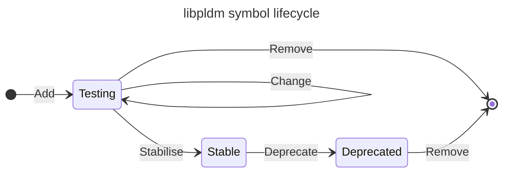

# libpldm

This is a library which deals with the encoding and decoding of PLDM messages.
It should be possible to use this library by projects other than OpenBMC, and
hence certain constraints apply to it:

- keeping it light weight
- implementation in C
- minimal dynamic memory allocations
- endian-safe
- no OpenBMC specific dependencies

Source files are named according to the PLDM Type, for eg base.[h/c], fru.[h/c],
etc.

Given a PLDM command "foo", the library will provide the following API: For the
Requester function:

```c
encode_foo_req() - encode a foo request
decode_foo_resp() - decode a response to foo
```

For the Responder function:

```c
decode_foo_req() - decode a foo request
encode_foo_resp() - encode a response to foo
```

The library also provides API to pack and unpack PLDM headers.

## To Build

Need `meson` and `ninja`. Alternatively, source an OpenBMC ARM/x86 SDK.

```sh
meson setup builddir && ninja -C builddir
```

## To run unit tests

The simplest way of running the tests is as described by the meson man page:

```sh
meson setup builddir && meson test -C builddir
```

## Working with `libpldm`

Components of the library ABI[^1] (loosely, functions) are separated into three
categories:

[^1]: ["library API + compiler ABI = library ABI"][libstdc++-library-abi]

[libstdc++-library-abi]:
  https://gcc.gnu.org/onlinedocs/libstdc++/manual/abi.html

1. Stable
2. Testing
3. Deprecated

Applications depending on `libpldm` should aim to only use functions from the
stable category. However, this may not always be possible. What to do when
required functions fall into the deprecated or testing categories is outlined
below.

### What does it mean to mark a function as stable?

Marking a function as stable makes the following promise to users of the
library:

> We will not remove or change the symbol name, argument count, argument types,
> return type, or interpretation of relevant values for the function before
> first marking it as `LIBPLDM_ABI_DEPRECATED` and then subsequently creating a
> tagged release

Marking a function as stable does _not_ promise that it is free of
implementation bugs. It is just a promise that the prototype won't change
without notice.

Given this, it is always okay to implement functions marked stable in terms of
functions marked testing inside of libpldm. If we remove or change the prototype
of a function marked testing the only impact is that we need to fix up any call
sites of that function in the same patch.

### The ABI lifecycle



The ABI of the library produced by the build is controlled using the `abi` meson
option. The following use cases determine how the `abi` option should be
specified:

| Use Case    | Meson Configuration               |
| ----------- | --------------------------------- |
| Production  | `-Dabi=deprecated,stable`         |
| Maintenance | `-Dabi=stable`                    |
| Development | `-Dabi=deprecated,stable,testing` |

### Maintenance

Applications and libraries that depend on `libpldm` can identify how to migrate
off of deprecated APIs by constraining the library ABI to the stable category.
This will force the compiler identify any call-sites that try to link against
deprecated symbols.

### Development

Applications and libraries often require functionality that doesn't yet exist in
`libpldm`. The work is thus in two parts:

1. Add the required APIs to `libpldm`
2. Use the new APIs from `libpldm` in the dependent application or library

Adding APIs to a library is a difficult task. Generally, once an API is exposed
in the library's ABI, any changes to the API risk breaking applications already
making use of it. To make sure we have more than one shot at getting an API
right, all new APIs must first be exposed in the testing category. Concretely:

Patches adding new APIs MUST mark them as testing and MUST NOT mark them as
stable.

### Marking functions as testing, stable or deprecated

Three macros are provided through `config.h` (automatically included for all
translation units) to mark functions as testing, stable or deprecated:

1. `LIBPLDM_ABI_TESTING`
2. `LIBPLDM_ABI_STABLE`
3. `LIBPLDM_ABI_DEPRECATED`

These annotations go immediately before your function signature:

```c
LIBPLDM_ABI_TESTING
pldm_requester_rc_t pldm_transport_send_msg(struct pldm_transport *transport,
                                            pldm_tid_t tid,
                                            const void *pldm_req_msg,
                                            size_t req_msg_len)
{
    ...
}
```

### Requirements for stabilising a function

As mentioned above, all new functions must first be added in the testing
category (using the `LIBPLDM_ABI_TESTING` annotation).

To move a function from the testing category to the stable category, its
required that patches demonstrating use of the function in a dependent
application or library be linked in the commit message of the stabilisation
change. We require this to demonstrate that the implementer has considered its
use in context _before_ preventing us from making changes to the API.

### Building a dependent application or library against a testing ABI

Meson is broadly used in the OpenBMC ecosystem, the historical home of
`libpldm`. Meson's subprojects are a relatively painless way of managing
dependencies for the purpose of developing complex applications and libraries.
Use of `libpldm` as a subproject is both supported and encouraged.

`libpldm`'s ABI can be controlled from a parent project through meson's
subproject configuration syntax:

```shell
$ meson setup ... -Dlibpldm:abi=deprecated,stable,testing ...
```

## OEM/vendor-specific functions

This will support OEM or vendor-specific functions and semantic information.
Following directory structure has to be used:

```text
 libpldm
    |---- include/libpldm
    |        |---- oem/<oem_name>
    |                    |----<oem based .h files>
    |---- src
    |        |---- oem/<oem_name>
    |                    |----<oem based .c files>
    |---- tests
    |        |---- oem/<oem_name>
    |                    |----<oem based test files>

```

<oem_name> - This folder must be created with the name of the OEM/vendor in
lower case.

Header files & source files having the oem functionality for the libpldm library
should be placed under the respective folder hierarchy as mentioned in the above
figure. They must be adhering to the rules mentioned under the libpldm section
above.

Once the above is done a meson option has to be created in `meson.options` with
its mapped compiler flag to enable conditional compilation.

For consistency would recommend using "oem-<oem_name>".

The `meson.build` and the corresponding source file(s) will need to incorporate
the logic of adding its mapped compiler flag to allow conditional compilation of
the code.
